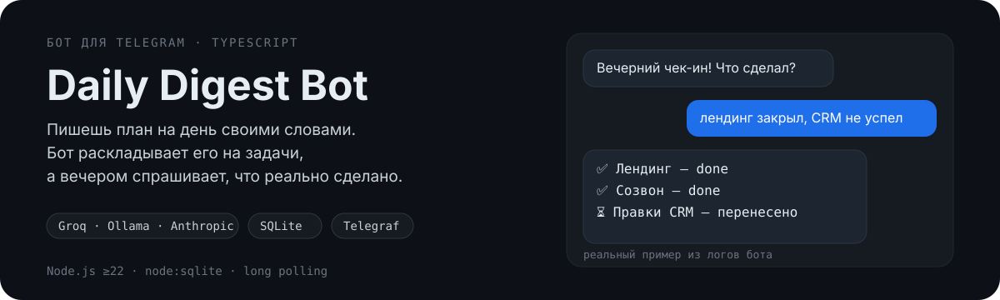
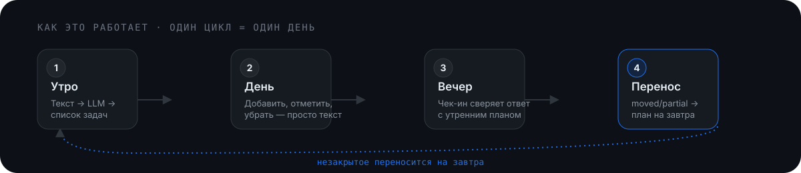

<p align="center">
  
</p>

## Что это

Telegram-бот для ежедневного управления задачами. Никаких форм и кнопок —
план на день, дневные обновления и вечерний отчёт пишутся обычным текстом,
LLM разбирает их в структурированные задачи.

- **Утром** — свободный текст становится списком задач с категорией (работа / личное)
- **Днём** — "закрыл лендинг", "добавь ещё созвон", "убери CRM" — без команд, просто текстом
- **Вечером** — бот сам спрашивает, что сделано, и сверяет ответ с утренним планом
- **Незакрытое** — автоматически переезжает в план на следующий день
- **По команде `/week`** — недельная статистика: % выполнения, что чаще всего переносится

## Как это работает

<p align="center">
  
</p>

Один Telegram-апдейт → один вызов LLM → JSON со списком задач или статусов,
который бот сохраняет в SQLite. LLM здесь — парсер и классификатор, а не хранилище:
источник истины всегда база, а не история чата.

## Быстрый старт

```bash
git clone https://github.com/Ejokey/DailyDigestBot.git
cd DailyDigestBot
npm install
cp .env.example .env   # заполнить TELEGRAM_BOT_TOKEN и GROQ_API_KEY
npm run build
npm start
```

## Переменные окружения

Полный список — в [`.env.example`](.env.example). Обязательные:

| Переменная | Назначение |
| --- | --- |
| `TELEGRAM_BOT_TOKEN` | токен от [@BotFather](https://t.me/BotFather) |
| `LLM_PROVIDER` | `groq` (по умолчанию) · `ollama` · `anthropic` |
| `GROQ_API_KEY` | нужен при `LLM_PROVIDER=groq` ([console.groq.com](https://console.groq.com), бесплатный тир) |

`LLM_PROVIDER` переключает бэкенд без изменения кода — LLM-слой полностью
изолирован в `src/llm/providers/`.

## Команды бота

| Команда | Действие |
| --- | --- |
| `/start` | приветствие и краткое описание |
| `/add <текст>` | добавить задачу в течение дня |
| `/done <номер>` | отметить задачу выполненной |
| `/move <номер>` | перенести задачу на завтра |
| `/drop <номер>` | убрать задачу |
| `/list` | текущий план на день по категориям |
| `/week` | недельная статистика |
| `/time <ЧЧ:ММ>` | время вечернего чек-ина |
| `/edit` | подсказка про свободный текст |

Плюс свободный текст без команд — LLM сам определяет намерение
(новый план, добавление, статус, отчёт, вопрос к боту).

## Деплой (Railway)

1. [railway.app](https://railway.app) → Login with GitHub
2. New Project → Deploy from GitHub repo → выбрать этот репозиторий
3. Railway сам определит Node.js, выполнит `npm install && npm run build`
   (см. `build`-скрипт в `package.json`), затем `npm start`
4. Settings → Variables — добавить переменные из `.env.example`
5. **Обязательно**: Settings → Volumes → подключить том на `/app/data`.
   Без этого SQLite-база обнуляется при каждом передеплое.

## Известные ограничения MVP

- Один Node-процесс на long polling — без горизонтального масштабирования
- Без volume на хостинге состояние не переживает передеплой (см. выше)
- Нет очереди/ретраев на сбой LLM-запроса — бот один раз отвечает об ошибке
- Категории задач — только `work` / `personal` / `other`, без кастомных

## Стек

Node.js · TypeScript · Telegraf · `node:sqlite` · node-cron · Groq / Ollama / Anthropic
